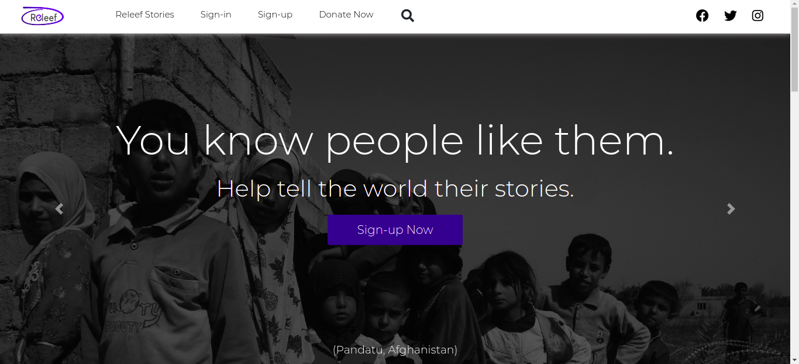

# Chabod-7.0

## Project site

This project is hosted live on netlify. Click on this link below to see it live -
https://releef.netlify.app

## About Releef

> Releef is a hackathon project of the DSC (developer student club - Federal polytechnic Bida Nigeria). It is  
> a project that is aimed at supporting poverty stricken regions of the world, by helping to tell the
> whole world their PAINFUL POVERTY stories through different means - through pictures especially. And also
> by providing a donation platform for recieving relief funds for those troubled regions.

> The project is currently stopped and incomplete.

## Project Stack/Build Tools

1. HTML5
2. CSS3
3. Bootstrap

### Releef Banner

